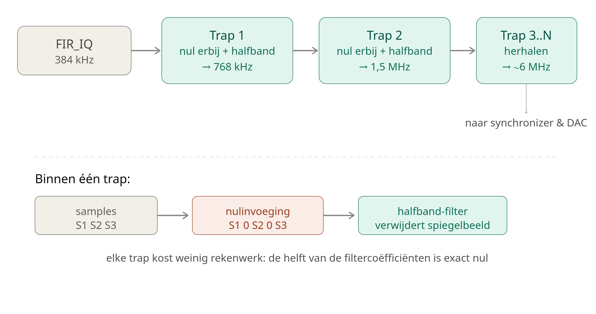

# Vivado-Zynq-7020-Chinese-ADALM-Pluto-kloon
Vivado Pluto (Zynq-7020 kloon) — I2S naar SDR-uitgang project, komende van ISE WebPack 14.7 / Spartan-6


# Pluto (Zynq-7020 kloon) — I2S naar SDR-uitgang project

Vivado-leerproject op een Chinese ADALM-Pluto-kloon (Zynq-7020), waarbij een
bestaand Spartan-6/ISE I2S-ontwerp wordt overgezet naar Vivado, en uitgebreid
tot een volledige RX → upsample → filter → IQ-modulatie → TX-keten.

## Doel

- Vivado leren kennen, komende van ISE WebPack 14.7 / Spartan-6.
- Een I2S-ingangssignaal (192 kHz samplerate) verwerken en upsamplen naar
  384 kHz, met FIR-filtering en fase-naar-IQ-omzetting (quarter-wave LUT),
  en als I2S-uitgang wegschrijven.
- Op termijn: integratie met de AD9361/9363 IQ-modulator die al op het board
  aanwezig is.

## Hardware

- **Board**: Chinese ADALM-Pluto-kloon met Xilinx Zynq-7020 (`xc7z020clg400-2`)
  en een AD9361/AD9363.
- **Systeemklok**: 50 MHz kristal op pin **N18** (bank 34) 
- **Baseband-header (J2/JP5, 20-pins)**: bevat twee I/O-banken op verschillende
  spanningen — zie tabel hieronder. 
## Bevestigde pin-mapping (JP5/J2-header)

Alle onderstaande pinnen zijn **experimenteel geverifieerd** met een
multimeter/oscilloscoop (niet alleen uit een schematic overgenomen — een
eerdere aanname bleek voor dit board niet te kloppen).

| JP5-pin | FPGA-pin | Bank | Spanning | Gebruikt voor |
|---|---|---|---|---|
| 1  | —   | —  | 5V (voeding)   | — |
| 2  | —   | —  | GND            | — |
| 3  | —   | —  | 3.3V (voeding) | — |
| 4  | G19 | 35 | 1.8V (LVCMOS18) | vrij / test geweest |
| 5  | —   | —  | 1.8V (voeding) | — |
| 6  | G20 | 35 | 1.8V (LVCMOS18) | i2s_reset |
| 7  | V10 | 13 | 3.3V (LVCMOS33) | I2S TX data |
| 8  | J18 | 35 | 1.8V (LVCMOS18) | i2s_in_lrclk |
| 9  | U9  | 13 | 3.3V (LVCMOS33) | vrij |
| 10 | H18 | 35 | 1.8V (LVCMOS18) | i2s_in_data |
| 11 | U10 | 13 | 3.3V (LVCMOS33) | I2S TX lrclk |
| 12 | H16 | 35 | 1.8V (LVCMOS18) | vrij / test geweest |
| 13 | T9  | 13 | 3.3V (LVCMOS33) | I2S TX bclk |
| 14 | H17 | 35 | 1.8V (LVCMOS18) | i2s_in_bclk |
| 15 | —   | —  | XTAL_VTC (vaste referentiefunctie) | **niet zelf aansturen** |
| 16 | L14 | 35 | 1.8V (LVCMOS18) | vrij / test geweest |
| 17 | —   | —  | PTT (vaste functie) | **niet zelf aansturen** |
| 18 | L15 | 35 | 1.8V (LVCMOS18) | vrij / test geweest |
| 19 | —   | —  | AD9361 SYNC (vaste functie) | **niet zelf aansturen** |
| 20 | —   | —  | GND | — |

> Pin 15, 17 en 19 zijn vermoedelijk verbonden met de VCTCXO-tuninglijn, een
> PTT-schakeling en de AD9361 sync-pin. Deze zijn **niet** met eigen logica
> getest om elektrisch conflict met bestaande schakelingen te voorkomen.

## Signaalketen (top.v)

```
i2s_in_bclk/lrclk/data (extern, 1.8V, bank 35)
        │
        ▼
     I2SRX  ──────────────► rx_sample[31:0], strobe (192 kHz)
        │
        ▼
   clk_wiz_1 (12.288 MHz → 24.576/49.152 MHz, exact ×2/×4)
        │
        ▼
   Upsampler (192 kHz → 384 kHz)
        │
        ▼
   FIR_Filter
        │
        ▼
   PHASEACCUMULATOR
        │
        ▼
   LUT90 (fase → I/Q, quarter-wave)
        │
        ▼
   FIR_IQ (frame-uitlijning, I- en Q-tak apart)
        │
        ▼
   I2STX ──► i2s_tx_bclk/lrclk/data (uitgang, 3.3V, bank 13)
```

`clk_wiz_0` (50 MHz → 12.288/24.576/49.152 MHz) was de eerste leeroefening in
Vivado's Clocking Wizard en zit nog in het project, maar wordt niet meer
gebruikt in de echte signaalketen — de outputs hangen bewust los.

## Belangrijkste lessen / valkuilen

- **Klokfrequentie niet aannemen, meten.** De originele XDC nam 40 MHz aan;
  het board bleek 50 MHz te hebben.
- **IOSTANDARD moet bij de fysieke VCCO passen.** Bank 35 bleek 1.8V te zijn,
  niet de aangenomen 2.5V — bevestigd door een output-pin op '1' te zetten en
  de spanning te meten (de fysieke VOH volgt altijd de echte VCCO, ongeacht
  wat er in de XDC gedeclareerd staat).
- **Niet elke pin is clock-capable.** Een externe BCLK op een niet-CC-pin
  (of de N-side van een differentieel paar) geeft een "IO Clock Placer
  failed"-fout; op te lossen met `CLOCK_DEDICATED_ROUTE FALSE` voor
  langzame kloksignalen.
- **Onbenutte top-level output-poorten mag je niet allemaal tegelijk laten
  hangen.** Eén poort zonder driver is onschuldig (wordt weggeoptimaliseerd),
  maar als *alle* paden naar een fysieke pin tegelijk wegvallen, optimaliseert
  Vivado de hele bijbehorende logica weg ("design is empty").
- **Test-signalen opruimen zodra hun doel bereikt is.** Meerdere generaties
  test-poorten (bijv. VCCO-meettests) die naast de echte functionele
  poorten blijven bestaan, leiden tot pin-tekort en "unplaced IO"-fouten.
- **Generieke online schematics voor Chinese boardklonen zijn niet
  betrouwbaar.** Zelfs P/N-toewijzing van differentiële pinnen bleek
  tegengesteld aan wat gangbare bronnen suggereerden — alleen Vivado's eigen
  DRC-melding (gebaseerd op de echte silicium-database) en eigen metingen
  gaven zekerheid.

## Projectstructuur

```
top.v              -- top-level module, instantieert alle blokken
I2SRX.v            -- I2S-ontvanger (overgenomen uit het Spartan-6 project)
Upsampler.v        -- 192 kHz -> 384 kHz
FIR_Filter.v        -- FIR-filter na upsampling
PHASEACCUMULATOR.v -- fase-accumulator voor IQ-modulatie
LUT90.v            -- quarter-wave lookup table, fase -> I/Q
FIR_IQ.v           -- FIR-filter + frame-uitlijning op I- en Q-tak
I2STX.v            -- I2S-uitgang
pluto_clock_test.xdc -- constraints (pin-toewijzing, klokken, IOSTANDARD)
```

## Openstaande punten / roadmap

- [ ] Bank 34 (N18, systeemklok) nog niet apart op VCCO gemeten.
- [ ] Nood-/fallback-klok bouwen voor als de externe I2S-BCLK wegvalt
      (was het oorspronkelijke doel van de Spartan-6 klok-switch-logica).
- [ ] Spanningsniveau-aanpassing (weerstandsdeler of actieve
      niveauvertaler) uitwerken voor de I2S RX-ingang als de externe bron
      op 3.3V zwaait.
- [ ] AD9361/9363-integratie (via ADI's `axi_ad9361`-referentie-IP).
- [ ] Zynq PS7 / IP Integrator block design verkennen.

## Licentie

Voeg hier je gewenste licentie toe (bijv. MIT, GPL-3.0).


# PlutoSDR: I2S/FM-synthese keten integreren in het officiële `pluto` HDL-project

## Doel

Een zelfgebouwde FPGA-keten (I2S-audio-ingang → upsampler → FIR-filter → phase accumulator → quarter-wave LUT → I/Q → FIR → I2S-uitgang, bedoeld voor FM-synthese) integreren in het officiële ADI `hdl/projects/pluto` project (Zynq 7020, ADALM-PLUTO / "Fishball"-kloon), zodat deze uiteindelijk data direct naar de interne AD9361-radiochip kan sturen in plaats van naar een externe AD8346 IQ-modulator.

Uiteindelijk resultaat: **werkend, reproduceerbaar firmware-image, succesvol getest op echte hardware (SD-boot), met hoorbaar audio-resultaat.**

---

## Belangrijkste inzicht vooraf

Twee bestaande designs werden gecombineerd:
- Een los I2S/FM-testproject (`top.v` + eigen XDC), dat oorspronkelijk naar externe pinnen / een externe AD8346 stuurde.
- Het officiële Pluto-project (`system_top.v`, `system_wrapper.bd` via `system_bd.tcl`), dat via `axi_ad9361` al rechtstreeks met de interne AD9361-radiochip praat (LVDS-lijnen `rx_data_in_*` / `tx_data_out_*`).

Je eigen logica toevoegen aan `system_top.v` is net zo simpel als een extra module-instantie toevoegen (zoals het bestaande `led_blinker`-voorbeeld al deed). De complexiteit zat 'm vrijwel volledig in: (1) pin-hergebruik-conflicten, (2) restanten van niet-gebruikte IP-blokken in het block design, en (3) reproduceerbaarheid van het hele buildsysteem.

---

## Problemen en oplossingen (chronologisch)

### 1. Pin-conflicten op de baseband-header (JP5)
Het I2S-testproject hergebruikte fysieke pinnen (`L14`, `L15`, `H17`, `V10`, `U9`, `U10`) die in het Pluto-project al bezet waren door de (ongebruikte) baseband-headerfunctionaliteit (`bb_in_ddr[0:5]`, `clk_to_bb`, `clk_to_sdr`, `IIC_0_0_*`, `gpio_bb_2`).

**Oplossing:** dezelfde fysieke pinnen hergebruiken voor de I2S-signalen, met de juiste `IOSTANDARD` (LVCMOS25/33 in plaats van de oorspronkelijke LVCMOS18), en de oude functienamen in de XDC vervangen door de nieuwe I2S-poortnamen.

### 2. "Multiple driver" / self-assign fout
```verilog
assign i2s_out_data384 = i2s_out_data384;  // overbodig en dubbele driver
```
**Oplossing:** verwijderd; de I2STX-instantie stuurt de poort al rechtstreeks aan.

### 3. MMCM/Clocking Wizard-fout na pin-ontkoppeling
```
[DRC REQP-123] The MMCME2_ADV with CLKINSEL tied high requires the CLKIN1 pin to be active.
```
Oorzaak: een *ander* (reeds in het block design aanwezig, niet door de gebruiker aangemaakt) Clocking Wizard-blok (`clk_wiz_0`) had zijn `clk_in1` verbonden met `clk_to_sdr` — een top-level poort die net was losgekoppeld. Dit blok, samen met `axi_bb_input_0`, was ooit handmatig via de GUI aan het block design toegevoegd en stond niet in `system_bd.tcl`.

**Oplossing:** `clk_wiz_0` én `axi_bb_input_0` volledig verwijderd uit het block design (canvas), gevalideerd, en de wrapper geregenereerd. *(Achteraf bleek dit sowieso nooit in een schone tcl-rebuild te zijn ontstaan — zie punt 7.)*

### 4. IOBUF-plaatsingsfouten voor IIC_0_0
Na het loskoppelen van `IIC_0_0_scl_io`/`sda_io` in `system_top.v` bleven de bijbehorende `IOBUF`-instanties in het (destijds nog geïmporteerde, statische) `system_wrapper.v`-bestand ongebruikt achter, zonder pin — "unplaced after IO placer".

**Oplossing:** de betreffende `IOBUF`-blokken en hun verbindingen handmatig uit dat specifieke gegenereerde bestand verwijderd.

### 5. Ontbrekende LR-klok op de I2S-uitgang
Bij het opschonen van een dubbele-driver-fout was per ongeluk ook de geldige `assign i2s_out_lrclk384 = i2s_out_lrclk;`-regel uitgecommentarieerd. Later opgelost door `I2STX` rechtstreeks aan de outputpoort te koppelen.

### 6. Reproduceerbaarheid: IP-cores en block-design-wijzigingen "overleven" geen schone build
Grote les: dit project wordt bij elke schone build **vanaf nul** opgebouwd via `system_project.tcl` (bronbestanden) en `system_bd.tcl` (block design). Handmatige aanpassingen die alleen in de Vivado-GUI of in automatisch gegenereerde bestanden (`system_wrapper.v`) zijn gedaan, verdwijnen bij een schone rebuild (`make clean && make`, of buildroot vanaf een verse checkout).

**Concrete acties om dit blijvend te maken:**
- Eigen Clocking Wizard (`clk_wiz_i2s`) toegevoegd als `.xci`-bestand in de projectmap, en geregistreerd in:
  - `system_project.tcl` → toegevoegd aan de `adi_project_files`-lijst.
  - `Makefile` (project-niveau) → `M_DEPS += clk_wiz_i2s.xci` geactiveerd.
- Bevestigd via `grep` dat `axi_bb_input_0`/`clk_wiz_0`/`bb_in_ddr`/`clk_to_sdr`/`IIC_0_0` **niet** voorkomen in `system_bd.tcl` — dus een schone build maakt deze blokken sowieso nooit aan. Geen verdere tcl-aanpassing nodig voor dit punt.
- Geverifieerd met een volledig schone rebuild (`rm -rf pluto.cache pluto.gen pluto.hw pluto.ip_user_files pluto.runs pluto.srcs pluto.xpr .Xil ADIIGNOREVERSIONCHECK1 && make -C hdl/projects/pluto`).

### 7. Timing closure faalde bij command-line build (maar niet in de GUI)
```
WNS = -6.700 ns, TNS = -26039.340 ns, 4568 falende eindpunten
```
De Vivado GUI accepteert een bitstream ook als timing niet gehaald wordt (alleen een waarschuwing); het `adi_project_impl`-buildscript van ADI keurt de build in dat geval bewust **hard af**. Root cause, zichtbaar in de "Inter Clock Table":
```
sys_clk_pin  →  clk_out1_clk_wiz_i2s   WNS=-5.728, TNS=-224.438
sys_clk_pin  →  clk_out2_clk_wiz_i2s   WNS=-6.700, TNS=-25814.902
```
Een reset-signaal (`i2s_reset`, gegenereerd in het `clk_in1`/`sys_clk_pin`-domein) werd gebruikt in de volledig ongerelateerde `clk_wiz_i2s`-uitgangsklokdomeinen, zonder dat deze twee klokgroepen als asynchroon waren gedeclareerd.

**Oplossing — toegevoegd aan `system_constr.xdc`:**
```tcl
set_clock_groups -asynchronous \
  -group [get_clocks sys_clk_pin] \
  -group [get_clocks -include_generated_clocks {clk_out1_clk_wiz_i2s clk_out2_clk_wiz_i2s}]
```
Resultaat: schone build met **0 errors**, timing gehaald.

### 8. Hoofdbuildsysteem (buildroot/Linux/u-boot) — download-fallback i.p.v. lokale HDL-build
```
wget ... plutosdr-fw/releases/download/v0.5.2/system_top.xsa
HTTP request sent, awaiting response... 404 Not Found
make: *** [Makefile:148: build/system_top.xsa] Error 8
```
Het hoofd-`Makefile` van de firmware-repository (`fish-wan-plutosdr-fw-7020-sdr`) detecteert zelf of een werkende Vivado-installatie beschikbaar is (`HAVE_VIVADO`). Zo ja: het bouwt de HDL lokaal en kopieert het resultaat automatisch. Zo nee: het valt terug op het downloaden van een kant-en-klare release — die download faalde (verouderde/niet-bestaande release-asset).

Er werd eerst geprobeerd dit handmatig te omzeilen (`mkdir build` + handmatig kopiëren van de `.xsa`), wat **niet betrouwbaar bleek** zolang de Vivado-detectie zelf niet klopte — de download-poging bleef terugkomen zodra `make` opnieuw werd aangeroepen.

**De uiteindelijke, werkende oplossing:**
```bash
cd ~/work/fish-wan-plutosdr-fw-7020-sdr
source ~/tools/Xilinx/Vitis/2022.2/settings64.sh
make VIVADO_SETTINGS=~/tools/Xilinx/Vivado/2022.2/settings64.sh VIVADO_VERSION=v2022.2

**En voor een schone rebuild de uiteindelijke werkende oplossing met rm tijdelijke directory ADIIGNOREVERSIONCHECK1:**

cd /home/willem/work/fish-wan-plutosdr-fw-7020-sdr/hdl/projects/pluto
rm -rf pluto.cache pluto.gen pluto.hw pluto.ip_user_files pluto.runs pluto.srcs pluto.xpr pluto.sdk pluto.sim .Xil ADIIGNOREVERSIONCHECK1 *.log *.jou
cd /home/willem/work/fish-wan-plutosdr-fw-7020-sdr
rm -f build/system_top.xsa
source ~/tools/Xilinx/Vitis/2022.2/settings64.sh
make VIVADO_SETTINGS=~/tools/Xilinx/Vivado/2022.2/settings64.sh VIVADO_VERSION=v2022.2
echo $?


# Fabric-directe koppeling van de I2S/FM-keten naar de AD9361 DAC (kanaal 0)

## Doel van vandaag

De bestaande I2S/FM-syntheseketen (die eerder al werkte via een I2S-uitgang naar een externe modulator) rechtstreeks — zonder DMA, zonder software-tussenkomst — laten schrijven naar de interne AD9361-radiochip van de PlutoSDR, door in te haken op een reeds aanwezige, maar tot dan toe met een interne DDS-testtoon gevulde, fabric-directe DAC-ingang.

**Resultaat: geslaagd.** Op de RF-uitgang verschijnt nu een FM-gemoduleerd MPX-signaal (draaggolf + stereo-piloot + RDS) dat rechtstreeks vanuit de FPGA-fabric wordt aangestuurd, bevestigd op een spectrumanalyzer/ontvanger.

---

## Architectuur-ontdekking

In `system_bd.tcl` bleek kanaal 0 (I0/Q0) van de `axi_ad9361`-core al fabric-direct aangestuurd te worden — niet via DMA, maar door een ingebouwde `dds_compiler_0` (een testtoongenerator), via twee `xlslice`-blokken die het brede DDS-woord in een 16-bit I- en Q-helft splitsen:
```tcl
dds_compiler_0/m_axis_data_tdata → xlslice_0/Din, xlslice_1/Din
xlslice_0/Dout → axi_ad9361/dac_data_q0
xlslice_1/Dout → axi_ad9361/dac_data_i0
```
Kanaal 1 (I1/Q1) van de AD9361 loopt via de normale DMA-weg (`tx_upack`) en is niet aangeraakt.

Bevestigd via `iio_info` dat dit inderdaad het "echte", door software/GNU Radio te gebruiken TX1-kanaal is (labels `TX1_I_F1/F2`, `TX1_Q_F1/F2` op `cf-ad9361-dds-core-lpc`) — geen apart kalibratie/BIST-kanaal.

De DAC-kant van de `axi_ad9361`-core draait op zijn eigen interne klok (`l_clk`/`axi_ad9361/clk`), een ander klokdomein dan de audioketen (`clk_49152`, uit de eigen `clk_wiz_i2s`).

---

## Uitgevoerde stappen

### Stap 1 — nieuwe poorten blootleggen (additief, niets losgekoppeld)
In `system_bd.tcl`: vijf nieuwe top-level poorten toegevoegd aan het block design, en drie bestaande signalen extra afgetapt (zonder de bestaande verbindingen te verwijderen):
```tcl
set dac_data_i0_fab   [ create_bd_port -dir I -from 15 -to 0 dac_data_i0_fab ]
set dac_data_q0_fab   [ create_bd_port -dir I -from 15 -to 0 dac_data_q0_fab ]
set dac_valid_i0_fab  [ create_bd_port -dir O dac_valid_i0_fab ]
set dac_enable_i0_fab [ create_bd_port -dir O dac_enable_i0_fab ]
set dac_clk_fab       [ create_bd_port -dir O dac_clk_fab ]
```
Extra aftakking toegevoegd aan de bestaande `connect_bd_net`-regels voor `dac_enable_i0`, `dac_valid_i0` en `l_clk`, elk uitgebreid met `[get_bd_ports ...]` naar de nieuwe poort. Geverifieerd zowel via `grep` op de tcl als visueel in Vivado (nieuwe losse poort-symbolen na "Regenerate Layout").

### Stap 2 — de oude DDS-koppeling vervangen
```tcl
# verwijderd:
connect_bd_net -net xlslice_0_Dout [get_bd_pins axi_ad9361/dac_data_q0] [get_bd_pins xlslice_0/Dout]
connect_bd_net -net xlslice_1_Dout [get_bd_pins axi_ad9361/dac_data_i0] [get_bd_pins xlslice_1/Dout]

# toegevoegd:
connect_bd_net -net fabric_dac_data_q0 [get_bd_pins axi_ad9361/dac_data_q0] [get_bd_ports dac_data_q0_fab]
connect_bd_net -net fabric_dac_data_i0 [get_bd_pins axi_ad9361/dac_data_i0] [get_bd_ports dac_data_i0_fab]
```
`dds_compiler_0`/`xlslice_0`/`xlslice_1` blijven in het ontwerp staan maar zijn nu functioneel afgekoppeld van de DAC.

In `system_top.v`, tijdelijk (vóór de synchronizer klaar was) de nieuwe ingangen op nul vastgezet om een geldige build te houden:
```verilog
.dac_data_i0_fab (16'sd0),
.dac_data_q0_fab (16'sd0),
```

### Stap 3 — klokdomein-synchronizer bouwen
Omdat de DAC-klok (~tientallen MHz) veel sneller is dan de update-snelheid van `I_filtered`/`Q_filtered` (audiosamplerate-orde), is geen FIFO nodig maar een simpele dubbele-flip-flop-synchronizer:
```verilog
wire dac_clk_fab;
reg signed [15:0] i0_sync_1, i0_sync_2;
reg signed [15:0] q0_sync_1, q0_sync_2;

always @(posedge dac_clk_fab) begin
    i0_sync_1 <= I_filtered[31:16];
    i0_sync_2 <= i0_sync_1;
    q0_sync_1 <= Q_filtered[31:16];
    q0_sync_2 <= q0_sync_1;
end
```
En in de `system_wrapper`-instantiatie:
```verilog
.dac_data_i0_fab (i0_sync_2),
.dac_data_q0_fab (q0_sync_2),
.dac_clk_fab (dac_clk_fab),
```

### Timing: nieuwe asynchrone klok-kruising
Net als bij de eerdere I2S-integratie faalde de eerste build op timing — ditmaal tussen de audioklok en de klok die Vivado voor de DAC-interface intern kennelijk onder de naam `rx_clk` rapporteert (de AD9361-core leidt zijn DAC-interfaceklok blijkbaar van dezelfde klokboom af als zijn RX-interfaceklok). Opgelost met, in `system_constr.xdc`:
```tcl
set_clock_groups -asynchronous \
  -group [get_clocks -include_generated_clocks {clk_out1_clk_wiz_i2s clk_out2_clk_wiz_i2s}] \
  -group [get_clocks rx_clk]
```
Na deze toevoeging: schone build, 0 errors, timing gehaald.

---

## Build- en testproces

Zelfde betrouwbare build-commando als bij de eerdere I2S-integratie:
```bash
cd ~/work/fish-wan-plutosdr-fw-7020-sdr
source ~/tools/Xilinx/Vitis/2022.2/settings64.sh
make VIVADO_SETTINGS=~/tools/Xilinx/Vivado/2022.2/settings64.sh VIVADO_VERSION=v2022.2
```
Bij twijfel over incrementele build-artefacten (zoals eerder ook al bleek onbetrouwbaar), eerst een volledig schone `hdl/projects/pluto`-map:
```bash
rm -rf pluto.cache pluto.gen pluto.hw pluto.ip_user_files pluto.runs pluto.srcs pluto.xpr pluto.sdk pluto.sim .Xil ADIIGNOREVERSIONCHECK1 *.log *.jou
```

SD-boot-image bouwen en testen zoals eerder:
```bash
make sdimg VIVADO_SETTINGS=~/tools/Xilinx/Vivado/2022.2/settings64.sh VIVADO_VERSION=v2022.2
```
Bestanden uit `build_sdimg/` (niet de submap `bootbin/`) op SD-kaart gezet, board in SD-boot-modus gestart.

**Testtoegang:** via seriële console (FTDI-adapter, `/dev/ttyUSB*`, 115200 baud, bijvoorbeeld met `screen`/`picocom`) toen de netwerkinterface niet direct zichtbaar was. Standaard login op deze firmware: gebruiker `root`, wachtwoord `analog` (of soms geen wachtwoord nodig via de seriële console).

**Configuratie van de AD9361 via libiio**, los van de databron van het DAC-kanaal:
```bash
iio_attr -c -o ad9361-phy voltage0 hardwaregain -10
iio_attr -c ad9361-phy altvoltage1 frequency <LO-frequentie in Hz>
```
(`-o` is nodig omdat `voltage0` zowel als input/RX- als output/TX-kanaal bestaat; zonder `-o` pakt `iio_attr` de verkeerde kant.)

---

## Belangrijke valkuil ontdekt: de `raw`-attribuut van de DDS-core heeft neveneffecten

Verwacht werd dat het uitzetten van de (nu toch al losgekoppelde) interne DDS-testtoon geen effect zou hebben op het fabric-signaal:
```bash
iio_attr -c cf-ad9361-dds-core-lpc altvoltage0 raw 0   # etc. voor 1, 2, 3
```
In de praktijk viel de carrier (met stereo-piloot en RDS — dus aantoonbaar het eigen fabric-signaal, niet de kale DDS-toon) hierdoor toch stil.

**Verklaring, bevestigd door de officiële ADI-documentatie:** sinds de introductie van de "grote kanaal-MUX" (`REG_CHAN_CNTRL_7`, `DAC_DDS_SEL`) in de HDL heeft het schrijven naar de `raw`-attribuut **neveneffecten** — het triggert een herevaluatie van de volledige databron-selectie voor dat DAC-kanaal, niet alleen het aan/uitzetten van de DDS-amplitude. Dit kan de multiplexer ongewild naar een andere stand zetten.

**Herstel:** een eenvoudige stroom-cyclus van het board bracht de juiste, werkende toestand terug (de driver leest bij opstart de devicetree-standaardconfiguratie opnieuw in).

**Praktische les:** raak de `raw`-attributen van `cf-ad9361-dds-core-lpc` niet meer aan tijdens het testen van de fabric-directe route. Controleer in plaats daarvan gewoon of het signaal kenmerken heeft die de kale DDS-toon nooit kon produceren (stereo-piloot, RDS) — dat is al voldoende bewijs dat het fabric-pad werkt, zonder de registers te hoeven aanraken.

---

## Openstaande punten voor een volgende sessie

- Preciezer uitzoeken waarom Vivado de DAC-interfaceklok onder de naam `rx_clk` rapporteert, en of dit implicaties heeft voor RX-kant timing.
- De exacte werking van `DAC_DDS_SEL`/`REG_CHAN_CNTRL_7` en de `raw`-attribuut-neveneffecten verder documenteren, zodat toekomstige tests dit bewust kunnen vermijden.
- Kanaal 1 (I1/Q1, DMA) is nog volledig ongewijzigd — mogelijk interessant om te bevestigen dat GNU Radio via de normale DMA-weg nog gewoon los daarvan blijft werken naast dit fabric-pad op kanaal 0.
- Burst-gedrag in de Upsampler-output (uit een eerdere sessie) nog niet opnieuw getest in deze nieuwe configuratie.

---


# Spectrale beelden (harmonischen) op de AD9361 fabric-directe DAC-uitgang

## Waargenomen probleem

Na het succesvol bevestigen van de fabric-directe koppeling naar AD9361 DAC-kanaal 0 (zie `ad9361-fabric-dac-koppeling.md`), bleek op een spectrumanalyzer dat het uitgezonden FM-signaal zich **elke 384 kHz herhaalt** over het hele hoogfrequente spectrum — te veel harmonischen/spiegelbeelden rondom de gewenste draaggolf.

## Diagnose

De oorzaak zit niet in ontbrekende filtering, maar in een fundamentele mismatch tussen twee snelheden in het ontwerp:

- De eigen audio/FM-keten (`FIR_IQ`) levert een nieuwe I/Q-sample op **384 kHz** (via `strobe_iq`).
- De AD9361-DAC zelf bemonstert echter op ongeveer **30,72 MHz** — bijna 80× sneller.

De huidige koppeling (een simpele dubbele-flip-flop-synchronizer, zie eerdere documentatie) geeft de DAC dus telkens dezelfde waarde zo'n 80 DAC-klokcycli achter elkaar, totdat er een nieuwe 384 kHz-sample beschikbaar is. Dit "vasthouden" van een waarde is een **zero-order-hold**, en dat veroorzaakt wiskundig onvermijdelijke spectrale herhalingen (images) van het gewenste signaal op elk veelvoud van de update-frequentie (384 kHz, 768 kHz, 1152 kHz, ...) — exact het patroon dat op de analyzer werd waargenomen.

## Onderzochte, maar afgewezen route: hergebruik van `tx_fir_interpolator`

Het block design (`system_bd.tcl`) bevat een reeds aanwezig blok genaamd `tx_fir_interpolator`, dat qua opzet bedoeld lijkt voor precies dit doel (DMA-rate samples interpoleren naar DAC-rate). Bij inspectie bleek echter:

- De **ingang** van dit blok (`data_in_0/1`) komt van `tx_upack`, dus van de normale DMA-databron — niet van onze eigen fabric-data.
- De **uitgang** (`data_out_0/1`) is in dit ontwerp **nergens mee verbonden** — een dood eindpunt. Het blok wordt alleen gebruikt om de DMA-FIFO "bezig te houden" (via `enable_out_0/1`, `valid_out_0/1`), niet om daadwerkelijk audio door te geven.
- De `active`-ingang hangt af van een runtime-instelbaar softwareregister (`up_dac_gpio_out`), en de interne filterconfiguratie/interpolatiefactor is niet zonder verder onderzoek van de hiërarchische celdefinitie te achterhalen.

**Conclusie:** hergebruik van dit blok zou aanzienlijke herbedrading en verder uitzoekwerk vereisen, met onzekere uitkomst. Voorlopig losgelaten ten gunste van een eigen, begrijpelijke oplossing.

## Gekozen oplossingsrichting: zelfgebouwde interpolatiecascade

In plaats van in één keer van 384 kHz naar DAC-snelheid te springen, wordt de sample-snelheid **stapsgewijs verdubbeld**, met tussen elke verdubbeling een filter dat de daarbij ontstane spiegelbeelden meteen weer opruimt:



1. **Nulinvoeging (upsampling ×2):** tussen elke bestaande sample wordt een sample met waarde 0 ingevoegd. Dit verdubbelt de sample-snelheid, maar creëert een nieuw spiegelbeeld van het spectrum.
2. **Halfband-laagdoorlaatfilter:** onderdrukt dat nieuw ontstane spiegelbeeld. Een halfband-filter is hiervoor bijzonder efficiënt in hardware, omdat door de specifieke keuze van afsnijfrequentie (een kwart van de nieuwe sample-snelheid) **de helft van de filtercoëfficiënten exact nul is** — die vermenigvuldigingen hoeven dus niet uitgevoerd te worden.
3. **Herhalen:** door deze stap een aantal keer achter elkaar te zetten (bijvoorbeeld 384 kHz → 768 kHz → 1,5 MHz → 3 MHz → 6 MHz), komen de overgebleven spiegelbeelden steeds verder van het gewenste signaal af te liggen en worden ze zwakker — met name relevant omdat het gewenste FM/MPX-signaal zelf maar zo'n 60 kHz breed is (audio + stereo-piloot + RDS).

Een volledige interpolatie tot aan de DAC-snelheid (~30,72 MHz) is naar verwachting niet nodig; al enkele trappen (richting 3-6 MHz, dus een factor 8-16×) zouden de zichtbare spiegelbeelden al drastisch moeten reduceren.

**Praktische implementatie:** Xilinx' **FIR Compiler**-IP heeft een ingebouwde "Interpolation"-modus met halfband-optie, die dit type filter automatisch genereert — waarschijnlijk te verkiezen boven het handmatig schrijven van een eigen interpolator-FIR.

## Alternatieve/aanvullende maatregel: analoge filtering na de AD9361

Een extern laagdoorlaat- of bandfilter op de RF-uitgang, afgestemd rond de gewenste draaggolf, kan spiegelbeelden die ver genoeg van het gewenste signaal liggen aanvullend onderdrukken. Dit is echter:
- **Kanaal-specifiek** — moet aangepast worden bij wisseling van zendfrequentie.
- **Geen vervanging** voor de digitale oplossing, enkel een laatste polijststap.

## Openstaand voor een volgende sessie

- Configuratie van een Xilinx FIR Compiler-IP in interpolatie/halfband-modus voor de eerste trap (384 → 768 kHz).
- Bepalen van het benodigde aantal cascade-trappen voor voldoende onderdrukking op de gebruikte testfrequentie.
- Eventueel alsnog nader onderzoek naar `tx_fir_interpolator` als die op termijn toch bruikbaar blijkt.

---

# Interpolatietrap 1: 384 kHz &rarr; 768 kHz, ter onderdrukking van spectrale spiegelbeelden

## Aanleiding

Zie `spectrale-beelden-interpolatie.md` voor de volledige diagnose: de fabric-directe AD9361-koppeling vertoonde spiegelbeelden op elke 384 kHz rond de gewenste FM-draaggolf, veroorzaakt door een zero-order-hold-effect (de DAC bemonstert ~80&times; vaker dan de audioketen nieuwe data levert).

Gekozen oplossing: een cascade van digitale interpolatietrappen (2&times; per trap), elk met een halfband-laagdoorlaatfilter om het bij die verdubbeling ontstane spiegelbeeld te onderdrukken.

## Filterontwerp (trap 1)

Berekend met Python/`scipy.signal.remez`, symmetrisch rond een kwart van de nieuwe sample-rate (192 kHz), met een ruime overgangsband dankzij het smalle (~65 kHz) gewenste FM/MPX-signaal:

- Doorlaatband-rand: 100 kHz
- Sperband-rand: 284 kHz
- Resultaat: 19 taps, 84,3 dB theoretische sperbanddemping, verwaarloosbare doorlaatband-rimpel (0,001 dB)
- Halfband-eigenschap bevestigd: alle oneven taps (behalve de middelste) zijn nagenoeg exact 0, wat in hardware vermenigvuldigingen bespaart

**Coefficient Vector** (16-bit signed integer, geschaald met factor 2¹⁶):
```
83,0,-499,-1,1775,2,-5168,-3,20193,32767,20193,-3,-5168,2,1775,-1,-499,0,83
```

## Implementatie in Vivado

1. **Xilinx FIR Compiler-IP** toegevoegd via IP Catalog (geen automatische passband/stopband-wizard beschikbaar in deze Vivado-versie &mdash; coëfficiënten worden zelf berekend en als vector geplakt).
2. Instellingen: Filter Type = Interpolation, Interpolation Rate = 2, Select Source = Vector (coëfficiënten hierboven), Coefficient Width = 16 (Signed), Input Sampling Frequency = 0.384 MHz, Clock Frequency = 49.152 MHz.
3. Component genaamd `fir_interp_384_768_i`; **gekopieerd** (rechtsklik &rarr; Copy IP) naar `fir_interp_384_768_q` voor het Q-kanaal &mdash; identieke configuratie, geen dubbel invulwerk.
4. Beide `.xci`-bestanden gekopieerd naar de projectmap en geregistreerd in `system_project.tcl` (`adi_project_files`-lijst) en de project-`Makefile` (`M_DEPS +=`), op dezelfde manier als eerder bij `clk_wiz_i2s.xci`.

## Instantiatie in `system_top.v`

Toegevoegd tussen de bestaande `FIR_IQ`-instanties (`filter_i`/`filter_q`) en de synchronizer die naar de AD9361 DAC-poorten schrijft:

```verilog
fir_interp_384_768_i u_interp_i (
    .aclk               (clk_49152),
    .s_axis_data_tvalid (strobe_iq),
    .s_axis_data_tready (s_i_tready),
    .s_axis_data_tdata  (I_filtered[31:16]),
    .m_axis_data_tvalid (m_i_valid),
    .m_axis_data_tdata  (m_i_data32)
);
// identiek voor het Q-kanaal
```

Belangrijk detail: de IP-uitgang (`m_axis_data_tdata`) is 32-bit, terwijl de ingang 16-bit was. Berekend (en bevestigd via de coëfficiënt-schaalfactor: DC-versterking &times; 2¹⁶) dat de correcte 16 bits om terug te lezen op **`[31:16]`** zitten &mdash; dezelfde conventie als eerder bij `phase_acc[31:16]`.

De synchronizer werd aangepast om te lezen van deze nieuwe interpolator-uitgang in plaats van rechtstreeks van `FIR_IQ`.

`s_axis_data_tready` wordt niet gecontroleerd: de invoer komt precies één keer per 128 klokcycli (`strobe_iq` bij 384 kHz op 49,152 MHz), wat exact overeenkomt met de door de IP zelf gerapporteerde "Clock cycles per input: 128" &mdash; de core is dus per ontwerp altijd klaar tegen de tijd dat er een nieuwe sample aankomt.

## Verificatie vóór het bouwen

Bevestigd via **RTL-schema** (Vivado: Open Elaborated Design &rarr; Schematic) dat de nieuwe blokken (`u_interp_i`, `u_interp_q`) precies tussen `filter_i`/`filter_q` en de synchronizer-registers (`i0_sync_1_reg` etc.) zijn geplaatst, met de juiste databreedte-aansluitingen.

## Build-valkuil: hoofdlettergevoeligheid

Bij het registreren van de `.xci`-bestanden ontstond een mismatch: het bestand heette op schijf `fir_interp_384_768_i.xci` (kleine letter), maar was in `system_project.tcl`/`Makefile` per ongeluk ingevoerd als `fir_interp_384_768_I.xci` (hoofdletter). Op het hoofdlettergevoelige Linux-bestandssysteem faalt dit stil totdat je het expliciet vergelijkt. Opgelost door consistent kleine letters te gebruiken in alle drie de bronnen (bestand op schijf, tcl, Makefile).

## Gemeten resultaat op hardware

Na een volledig schone rebuild en herflashen van de SD-kaart:
- De oorspronkelijke 384 kHz-spiegelbeelden zijn verschoven naar **768 kHz** (de nieuwe update-frequentie) &mdash; bevestigt dat de eerste-orde spiegels daadwerkelijk zijn weggefilterd.
- De resterende 768 kHz-spiegelbeelden liggen circa **40 dB** onder de gewenste draaggolf.
- Dit is minder dan de 84 dB theoretische/gesimuleerde sperbanddemping van het filter zelf &mdash; het verschil wordt toegeschreven aan overige systeembeperkingen (AD9361 eigen SFDR, kwantisatieruis, de resterende hold-tijd van de synchronizer zelf op de nu hogere sample-rate).

## Zijspoor: AD9361 ingebouwde kalibratie (`calib_mode`)

Onderzocht of de AD9361's ingebouwde TX-kwadratuur- en DC-offsetkalibratie (bereikbaar via libiio, geen FPGA-wijziging nodig) verbetering zou geven:
```bash
iio_attr -u ip:<pluto-ip> -d ad9361-phy calib_mode tx_quad
iio_attr -u ip:<pluto-ip> -d ad9361-phy calib_mode rf_dc_offs
```
(Let op: `calib_mode` is een **device**-attribuut, dus `-d`, niet `-c`.)

**Belangrijke conclusie na discussie:** deze kalibraties corrigeren specifiek **LO-lekkage** (een piek op de draaggolf zelf) en **IQ-onbalans** (een asymmetrisch spiegelbeeld aan weerszijden van de draaggolf) in het analoge pad van de chip. Dit is een **ander fenomeen** dan de 384/768 kHz zero-order-hold-spiegelbeelden waar deze sessie zich op richtte &mdash; vandaar dat deze kalibraties geen merkbaar effect gaven op dat specifieke probleem. Ze blijven wel relevant als er apart een LO-lekkage of IQ-onbalans-symptoom wordt waargenomen op de analyzer.

Een eerdere aanname dat dit fabric-directe pad de kalibratieblokken van de AD9361 zou "omzeilen" bleek bij nader inzien ongefundeerd: de kalibratie werkt op het digitale-naar-analoge-conversiepunt zelf, ongeacht of de data van DMA of van de fabric komt &mdash; dit is echter niet geverifieerd met een meting, alleen beargumenteerd.

## Openstaand voor een volgende sessie

- Een tweede interpolatietrap (768 &rarr; 1536 kHz) is inmiddels ontworpen en gesimuleerd (zie eventueel vervolg-documentatie), nog niet gebouwd/getest op hardware.
- Optioneel: digitale IQ-onbalans-/DC-offsetcorrectie zelf in de FPGA-fabric bouwen (fase-, gain- en DC-correctie op I/Q vóór de synchronizer), voor het geval de AD9361's eigen kalibratie niet volstaat voor fouten die in de eigen `LUT90`/`PHASEACCUMULATOR`-digitale keten ontstaan.

---

*Samengevat vanuit een troubleshooting-sessie met Claude (Anthropic).*

# IQ-kalibratie via libiio en een GUI voor live afregeling

## Achtergrond

Na het toevoegen van instelbare testtoon, fase-, gain- en DC-offsetregisters in de FPGA-fabric (zie eerdere documentatie), bleek er nog een wobbelende, langzaam variërende interferentie hoorbaar te zijn naast de eerder opgeloste spectrale spiegelbeelden. Dit leidde tot een verkenning van de AD9361's eigen, ingebouwde IQ-kalibratiemechanismen als aanvulling op de zelfgebouwde FPGA-correctie.

## AD9361 `calib_mode`-attribuut (device-attribuut, dus `-d` bij `iio_attr`)

Overzicht van de mogelijke waarden, gevonden via `iio_info` (`calib_mode_available`) en de ADI-documentatie:

| Waarde | Betekenis |
|---|---|
| `auto` | Standaardmodus — de driver voert automatisch periodiek alle kalibraties uit wanneer nodig (bijvoorbeeld bij LO-wisseling). |
| `manual` | Alle automatische kalibratie uitgeschakeld — jij bepaalt zelf wanneer wat draait. |
| `manual_tx_quad` | Schakelt naar handmatige modus, specifiek gericht op TX-kwadratuur — geeft meer controle over de timing/omstandigheden van de TX-kalibratie. |
| `tx_quad` | Triggert **eenmalig** de TX-kwadratuurkalibratie, en valt daarna terug naar de vorige modus (vandaar dat uitlezen na deze actie gewoon weer `auto` toont). |
| `rf_dc_offs` | Triggert specifiek een RF DC-offset-kalibratie. |
| `rssi_gain_step` | Triggert een RSSI/gain-stap-kalibratie (voornamelijk relevant voor de ontvangstkant, niet voor TX). |

**Gebruik:**
```bash
iio_attr -u ip:<pluto-ip> -d ad9361-phy calib_mode           # huidige stand lezen
iio_attr -u ip:<pluto-ip> -d ad9361-phy calib_mode tx_quad   # eenmalige TX-kwadratuurkalibratie
iio_attr -u ip:<pluto-ip> -d ad9361-phy calib_mode rf_dc_offs
```

**Belangrijke nuance:** deze kalibraties corrigeren **analoge onvolkomenheden in de AD9361-chip zelf** (DAC-mismatch, mixer-onbalans) — niet fouten die de eigen digitale keten (`LUT90`/`PHASEACCUMULATOR`) al in de data introduceert vóór die de chip bereikt. Een eerdere aanname dat het fabric-directe datapad deze kalibratie zou "omzeilen" bleek bij nader inzien ongefundeerd (de kalibratie werkt op het digitale-naar-analoge-conversiepunt, ongeacht databron), maar is niet met een meting bevestigd.

## Handmatige IQ-balans in de HDL-core

Naast de automatische chipkalibratie bestaan er ook direct instelbare `calibscale`/`calibphase`-attributen op het device `cf-ad9361-dds-core-lpc` (kanalen `voltage0`–`voltage3`), standaard op 1.000000 respectievelijk 0.000000:

```bash
iio_attr -u ip:<pluto-ip> -c -o cf-ad9361-dds-core-lpc voltage1 calibscale 0.98
iio_attr -u ip:<pluto-ip> -c -o cf-ad9361-dds-core-lpc voltage1 calibphase 0.01
```

De exacte eenheid van `calibphase` kon niet met zekerheid worden vastgesteld — geadviseerd wordt met kleine stapjes te beginnen en het effect op de spectrumanalyzer te observeren.

**Praktisch advies voor het afregelen:** met drie plekken die dezelfde soort fout kunnen corrigeren (chipkalibratie, `calibscale`/`calibphase`, en de eigen FPGA-correctieregisters), is het aan te raden telkens één voor één te testen: eerst de FPGA-registers op neutraal zetten, dan `calib_mode tx_quad` proberen en meten, dan pas `calibscale`/`calibphase`, en als laatste de eigen FPGA-correctie. Een LO-wissel kan de automatische kalibratie triggeren en eerdere handmatige instellingen overschrijven.

## Overige AD9361-instellingen via `iio_attr`

```bash
iio_attr -u ip:<pluto-ip> -c -o ad9361-phy altvoltage1 frequency <Hz>        # TX-LO
iio_attr -u ip:<pluto-ip> -c -o ad9361-phy voltage0 hardwaregain <dB>        # TX-gain
iio_attr -u ip:<pluto-ip> -c -o ad9361-phy voltage0 rf_bandwidth <Hz>        # TX-bandbreedte
iio_attr -u ip:<pluto-ip> -c -o ad9361-phy voltage0 sampling_frequency <Hz>  # samplerate
```
De samplerate wordt bij voorkeur op 30.720.000 Hz gelaten, aangezien de fabric-keten en timing-constraints daarop zijn gebouwd en getest.

`-o` is verplicht bij TX-attributen zoals `hardwaregain`, omdat `voltage0` zowel als RX- als TX-kanaal bestaat; zonder `-o` pakt `iio_attr` de RX-kant, wat een "Operation not supported"-fout geeft zolang AGC niet op manual staat.

---

## FPGA-implementatie: hoe de IQ-afregeling en aansturing in de hardware werkt

Naast de AD9361-eigen kalibratie hierboven is er een volledig eigen, in de FPGA-fabric gebouwde correctieketen, die specifiek de kwaliteit van het **zelf gegenereerde** I/Q-signaal aanpakt (dus fouten die al vóór de AD9361 ontstaan, in `LUT90`/`PHASEACCUMULATOR`) — dit is nodig omdat de AD9361's eigen kalibratie alleen zijn eigen analoge pad corrigeert, niet de digitale bron.

### Aansturing: zes AXI GPIO-registers

Elke correctieparameter heeft een eigen, apart AXI GPIO-blok (16-bit breed, alleen-uitgang), toegevoegd aan het block design (`system_bd.tcl`) op dezelfde manier als eerdere IP's (`clk_wiz_i2s`, de FIR-interpolatoren). Elk blok krijgt zijn eigen AXI-adres via de `axi_cpu_interconnect` (uitgebreid van 6 naar 11 master-poorten, `M05` t/m `M10`), en is dus vanuit Linux direct beschrijfbaar met `devmem`:

| Register | Adres | Functie |
|---|---|---|
| `tone_offset` | `0x41200000` | Statische modulatie-offset; vervangt de oorspronkelijke vaste `16'sd10000` in `PHASEACCUMULATOR.v`. |
| `phase` | `0x41210000` | Fasecorrectie tussen I en Q, fixed-point (zie hieronder). |
| `gain_i` | `0x41220000` | Versterkingscorrectie I-kanaal, fixed-point. |
| `gain_q` | `0x41230000` | Versterkingscorrectie Q-kanaal, fixed-point. |
| `dc_i` | `0x41240000` | DC-offsetcorrectie I-kanaal, direct 16-bit signed. |
| `dc_q` | `0x41250000` | DC-offsetcorrectie Q-kanaal, direct 16-bit signed. |

**Belangrijk implementatiedetail:** de zes poorten zijn als Xilinx `gpio_rtl`-**interface**-poorten aangemaakt (niet als simpele data-poorten zoals eerder bij `dac_data_i0_fab`). Dat betekent dat de namen in de automatisch gegenereerde `system_wrapper.v` een `_tri_o`-achtervoegsel krijgen (bijvoorbeeld `tone_offset_fab_tri_o` in plaats van `tone_offset_fab`) — dit moest na elke build gecontroleerd worden met `grep` op het gegenereerde wrapper-bestand, omdat het niet vooraf voorspelbaar was zonder de IP daadwerkelijk te genereren.

Elk GPIO-blok vereiste, naast de eigen cell-instantie, ook:
- Een eigen `S_AXI`-koppeling aan de interconnect (`M0x_AXI`).
- Opname van zijn `s_axi_aclk`/`s_axi_aresetn`-pinnen in de bestaande gedeelde klok-/reset-net van het systeem (een veelgemaakte fout tijdens de ontwikkeling: het uitbreiden van de interconnect-kant alleen is niet genoeg, de peripheral-kant moet ook expliciet in dezelfde net worden opgenomen).
- Een eigen adrestoewijzing (`assign_bd_address`) binnen de `sys_ps7/Data`-adresruimte.

### Instelbare testtoon via `tone_offset`

In plaats van een apart aan/uit-bit toe te voegen, is gekozen voor een elegantere oplossing: de testmodus wordt afgeleid uit de waarde van `tone_offset` zelf.

```verilog
if (tone_offset != 16'sd0) begin
    sample <= tone_offset;      // testmodus: vaste, instelbare modulatie-offset
end else begin
    sample = sample_in;         // normale modus: live audio (let op: blocking assignment)
end
```

Het bewust gemengde gebruik van blocking (`=`) voor het normale audiopad en non-blocking (`<=`) voor het testpad is een doelbewuste, van het originele Spartan-6-ontwerp overgenomen keuze: het normale pad moet zonder extra pijplijnvertraging reageren (`phase_acc` gebruikt de nieuwe `sample`-waarde binnen dezelfde cyclus), terwijl één cyclus vertraging op het incidenteel ingestelde testpad volledig onschadelijk is.

### De correctieketen zelf: gain → fase → DC-offset

Tussen de uitgang van `LUT90` (`I16`/`Q16`, elk 32-bit signed) en de invoer van de bestaande `FIR_IQ`-filters is de volgende keten toegevoegd in `system_top.v`:

```verilog
wire signed [15:0] dc_i    = dc_i_fab_tri_o;
wire signed [15:0] dc_q    = dc_q_fab_tri_o;
wire signed [15:0] gain_i  = gain_i_fab_tri_o;   // Q2.14 fixed-point: 0x4000 (16384) = 1,0
wire signed [15:0] gain_q  = gain_q_fab_tri_o;
wire signed [15:0] phase_c = phase_fab_tri_o;    // Q2.14 fixed-point: sin(fasefout)

// Stap 1: versterking toepassen
wire signed [47:0] i_gained_full = I16 * gain_i;
wire signed [47:0] q_gained_full = Q16 * gain_q;
wire signed [31:0] i_gained = i_gained_full[45:14];
wire signed [31:0] q_gained = q_gained_full[45:14];

// Stap 2: fasecorrectie (klassieke IQ-onbalansformule: Q_correct = Q - sin(fase)*I)
wire signed [47:0] phase_corr_full = i_gained * phase_c;
wire signed [31:0] phase_corr = phase_corr_full[45:14];
wire signed [31:0] q_phase_corrected = q_gained - phase_corr;

// Stap 3: DC-offset optellen
wire signed [31:0] I_data = i_gained          + {{16{dc_i[15]}}, dc_i};
wire signed [31:0] Q_data = q_phase_corrected + {{16{dc_q[15]}}, dc_q};
```

Deze keten is na synthese gecontroleerd in Vivado's RTL-schematic-weergave (Open Elaborated Design → Schematic), waarbij zichtbaar werd bevestigd dat de vier vermenigvuldigers (`RTL_MULT`), de aftrekker (`RTL_SUB`) en de twee optellers (`RTL_ADD`) precies in de bedoelde volgorde en met de juiste bitbreedtes zijn gesynthetiseerd — een nuttige, onafhankelijke bevestiging naast het lezen van de Verilog-code zelf.

**Fixed-point-conventie:** `gain_i`/`gain_q`/`phase` gebruiken Q2.14-fixed-point (16-bit signed, 14 fractionele bits), waarbij 16384 overeenkomt met 1,0. De bit-slice `[45:14]` na elke 32×16-bit vermenigvuldiging haalt het resultaat terug naar de oorspronkelijke 32-bit schaal. `dc_i`/`dc_q` zijn daarentegen directe 16-bit signed waarden, geen fixed-point — vandaar de tekenextensie (`{{16{dc_i[15]}}, dc_i}`) in plaats van een schaalbewerking.

### Timing-gevolgen van de nieuwe registers

Het toevoegen van deze zes GPIO's (die op `clk_fpga_0`, de 100 MHz Zynq-processorklok, worden beschreven vanuit software) en het gebruiken van hun waarden binnen het `clk_49152`-audioklokdomein introduceerde een nieuwe asynchrone klokkruising, op te lossen met dezelfde aanpak als eerder in het project:

```tcl
set_clock_groups -asynchronous -group [get_clocks -include_generated_clocks {clk_out1_clk_wiz_i2s clk_out2_clk_wiz_i2s}] -group [get_clocks clk_fpga_0]
```

Daarnaast dook een klein, op zichzelf staand timing-tekort op (71 picoseconden, 2 eindpunten) in een geheel ongerelateerd, al bestaand DMA-pad van het originele ADI-ontwerp (`axi_ad9361_dac_dma` → `tx_upack`) — dit bleek een toeval van herschikte chip-plaatsing door de extra logica, niet een fout in de nieuwe registers zelf, en is opgelost met een gerichte `set_false_path` op precies dat pad.

Omdat correctiewaarden zoals gain/fase/DC-offset incidenteel en handmatig worden ingesteld (niet continu, tijdkritisch wisselend), is een asynchrone klok-declaratie hier functioneel verantwoord — met de kanttekening dat een multi-bit waarde die op deze manier van klokdomein wisselt in theorie een incoherente (deels oude, deels nieuwe) overgang zou kunnen ondervinden als de waarde precies op het leesmoment verandert. Voor een waarde die je zet en dan laat staan, is dat risico in de praktijk verwaarloosbaar.

---

## GUI voor live IQ-afregeling (`pluto_iq_gui.py`)

Om niet telkens losse `devmem`/`iio_attr`-commando's te hoeven typen, is een Python/tkinter-programma met schuifregelaars gebouwd dat via SSH verbinding maakt met de Pluto en bij elke sliderbeweging het juiste commando op afstand uitvoert.

### Functionaliteit
- **Zes schuifregelaars** voor de eigen FPGA-registers: `tone_offset`, `phase`, `gain_i`, `gain_q`, `dc_i`, `dc_q`, met `-`/`+`-knoppen voor fijnafstelling. Gain toont ook de werkelijke factor (16384 = 1,000), fase toont een geschatte hoek in graden.
- **AD9361-sectie**: TX-gain, `calibscale` I/Q, `calibphase` Q, TX-LO instellen, en knoppen voor de `tx_quad`- en `rf_dc_offs`-kalibratietriggers.
- **Neutraal-knop** (reset naar gain=1.0, rest=0) en een testtoon-aan/uit-knop.
- **Automatisch opslaan/laden**: alle instellingen (IP, gebruiker, wachtwoord, alle sliderwaarden, LO-frequentie) worden een halve seconde na elke wijziging en bij het afsluiten weggeschreven naar `pluto_iq_settings.json` naast het script, en bij de volgende start automatisch weer ingelezen — inclusief een optioneel vinkje "auto-verbinden bij start" dat bij het openen meteen verbindt en alle waarden naar de Pluto stuurt.
- **Robuuste JSON-afhandeling**: waarden buiten het toegestane bereik worden afgekapt, ontbrekende of ongeldige velden vallen terug op standaardwaarden, en een corrupt instellingenbestand wordt bewaard als `.bad` in plaats van stilzwijgend overschreven.

### Werking onder de motorkap
- Eén achtergrondthread (`Sender`) stuurt de commando's naar de Pluto via een `paramiko`-SSH-verbinding; snel achter elkaar bewegen van een slider resulteert in slechts de laatste waarde die daadwerkelijk verstuurd wordt (per registernaam wordt alleen de nieuwste opdracht bewaard).
- Een `--dry-run`-modus toont alle commando's die verstuurd zouden worden zonder daadwerkelijk verbinding te maken — nuttig om te testen of de juiste `devmem`/`iio_attr`-aanroepen worden opgebouwd.
- Negatieve 16-bit waarden worden correct omgezet naar two's-complement hexadecimaal voor `devmem` (bijvoorbeeld fase -350 → `0xFEA2`).

### Installatie
```bash
# Linux
sudo apt install python3-tk
pip install paramiko

# Windows
pip install paramiko   # tkinter zit al bij een standaard Python-installatie
```

### Bekend aandachtspunt
Na elke herstart van de Pluto staan de AXI GPIO-registers op 0 — dat betekent `gain_i = gain_q = 0`, waardoor de IQ-correctie alles met nul vermenigvuldigt en er geen signaal meer uitkomt totdat de gain opnieuw wordt ingesteld. De GUI lost dit op door bij het verbinden automatisch alle sliderwaarden (met gain standaard op 16384 = 1,0) naar de Pluto te sturen. Zonder de GUI dient hiervoor `iq_tune.sh reset` te worden gebruikt.

---

*Samengevat vanuit een troubleshooting-sessie met Claude (Anthropic).*

