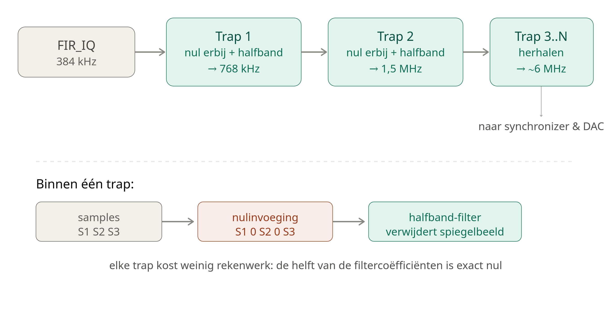

# Vivado-Zynq-7020-Chinese-ADALM-Pluto-kloon
Vivado Pluto (Zynq-7020 kloon) — I2S naar SDR-uitgang project, komende van ISE WebPack 14.7 / Spartan-6


# Pluto (Zynq-7020 kloon) — I2S naar SDR-uitgang project

Vivado-leerproject op een Chinese ADALM-Pluto-kloon (Zynq-7020), waarbij een
bestaand Spartan-6/ISE I2S-ontwerp wordt overgezet naar Vivado, en uitgebreid
tot een volledige RX → upsample → filter → IQ-modulatie → TX-keten.

## Doel

- Vivado leren kennen, komende van ISE WebPack 14.7 / Spartan-6.
- Een I2S-ingangssignaal (192 kHz samplerate) verwerken en upsamplen naar
  384 kHz, met FIR-filtering en fase-naar-IQ-omzetting (quarter-wave LUT),
  en als I2S-uitgang wegschrijven.
- Op termijn: integratie met de AD9361/9363 IQ-modulator die al op het board
  aanwezig is.

## Hardware

- **Board**: Chinese ADALM-Pluto-kloon met Xilinx Zynq-7020 (`xc7z020clg400-2`)
  en een AD9361/AD9363.
- **Systeemklok**: 50 MHz kristal op pin **N18** (bank 34) 
- **Baseband-header (J2/JP5, 20-pins)**: bevat twee I/O-banken op verschillende
  spanningen — zie tabel hieronder. 
## Bevestigde pin-mapping (JP5/J2-header)

Alle onderstaande pinnen zijn **experimenteel geverifieerd** met een
multimeter/oscilloscoop (niet alleen uit een schematic overgenomen — een
eerdere aanname bleek voor dit board niet te kloppen).

| JP5-pin | FPGA-pin | Bank | Spanning | Gebruikt voor |
|---|---|---|---|---|
| 1  | —   | —  | 5V (voeding)   | — |
| 2  | —   | —  | GND            | — |
| 3  | —   | —  | 3.3V (voeding) | — |
| 4  | G19 | 35 | 1.8V (LVCMOS18) | vrij / test geweest |
| 5  | —   | —  | 1.8V (voeding) | — |
| 6  | G20 | 35 | 1.8V (LVCMOS18) | i2s_reset |
| 7  | V10 | 13 | 3.3V (LVCMOS33) | I2S TX data |
| 8  | J18 | 35 | 1.8V (LVCMOS18) | i2s_in_lrclk |
| 9  | U9  | 13 | 3.3V (LVCMOS33) | vrij |
| 10 | H18 | 35 | 1.8V (LVCMOS18) | i2s_in_data |
| 11 | U10 | 13 | 3.3V (LVCMOS33) | I2S TX lrclk |
| 12 | H16 | 35 | 1.8V (LVCMOS18) | vrij / test geweest |
| 13 | T9  | 13 | 3.3V (LVCMOS33) | I2S TX bclk |
| 14 | H17 | 35 | 1.8V (LVCMOS18) | i2s_in_bclk |
| 15 | —   | —  | XTAL_VTC (vaste referentiefunctie) | **niet zelf aansturen** |
| 16 | L14 | 35 | 1.8V (LVCMOS18) | vrij / test geweest |
| 17 | —   | —  | PTT (vaste functie) | **niet zelf aansturen** |
| 18 | L15 | 35 | 1.8V (LVCMOS18) | vrij / test geweest |
| 19 | —   | —  | AD9361 SYNC (vaste functie) | **niet zelf aansturen** |
| 20 | —   | —  | GND | — |

> Pin 15, 17 en 19 zijn vermoedelijk verbonden met de VCTCXO-tuninglijn, een
> PTT-schakeling en de AD9361 sync-pin. Deze zijn **niet** met eigen logica
> getest om elektrisch conflict met bestaande schakelingen te voorkomen.

## Signaalketen (top.v)

```
i2s_in_bclk/lrclk/data (extern, 1.8V, bank 35)
        │
        ▼
     I2SRX  ──────────────► rx_sample[31:0], strobe (192 kHz)
        │
        ▼
   clk_wiz_1 (12.288 MHz → 24.576/49.152 MHz, exact ×2/×4)
        │
        ▼
   Upsampler (192 kHz → 384 kHz)
        │
        ▼
   FIR_Filter
        │
        ▼
   PHASEACCUMULATOR
        │
        ▼
   LUT90 (fase → I/Q, quarter-wave)
        │
        ▼
   FIR_IQ (frame-uitlijning, I- en Q-tak apart)
        │
        ▼
   I2STX ──► i2s_tx_bclk/lrclk/data (uitgang, 3.3V, bank 13)
```

`clk_wiz_0` (50 MHz → 12.288/24.576/49.152 MHz) was de eerste leeroefening in
Vivado's Clocking Wizard en zit nog in het project, maar wordt niet meer
gebruikt in de echte signaalketen — de outputs hangen bewust los.

## Belangrijkste lessen / valkuilen

- **Klokfrequentie niet aannemen, meten.** De originele XDC nam 40 MHz aan;
  het board bleek 50 MHz te hebben.
- **IOSTANDARD moet bij de fysieke VCCO passen.** Bank 35 bleek 1.8V te zijn,
  niet de aangenomen 2.5V — bevestigd door een output-pin op '1' te zetten en
  de spanning te meten (de fysieke VOH volgt altijd de echte VCCO, ongeacht
  wat er in de XDC gedeclareerd staat).
- **Niet elke pin is clock-capable.** Een externe BCLK op een niet-CC-pin
  (of de N-side van een differentieel paar) geeft een "IO Clock Placer
  failed"-fout; op te lossen met `CLOCK_DEDICATED_ROUTE FALSE` voor
  langzame kloksignalen.
- **Onbenutte top-level output-poorten mag je niet allemaal tegelijk laten
  hangen.** Eén poort zonder driver is onschuldig (wordt weggeoptimaliseerd),
  maar als *alle* paden naar een fysieke pin tegelijk wegvallen, optimaliseert
  Vivado de hele bijbehorende logica weg ("design is empty").
- **Test-signalen opruimen zodra hun doel bereikt is.** Meerdere generaties
  test-poorten (bijv. VCCO-meettests) die naast de echte functionele
  poorten blijven bestaan, leiden tot pin-tekort en "unplaced IO"-fouten.
- **Generieke online schematics voor Chinese boardklonen zijn niet
  betrouwbaar.** Zelfs P/N-toewijzing van differentiële pinnen bleek
  tegengesteld aan wat gangbare bronnen suggereerden — alleen Vivado's eigen
  DRC-melding (gebaseerd op de echte silicium-database) en eigen metingen
  gaven zekerheid.

## Projectstructuur

```
top.v              -- top-level module, instantieert alle blokken
I2SRX.v            -- I2S-ontvanger (overgenomen uit het Spartan-6 project)
Upsampler.v        -- 192 kHz -> 384 kHz
FIR_Filter.v        -- FIR-filter na upsampling
PHASEACCUMULATOR.v -- fase-accumulator voor IQ-modulatie
LUT90.v            -- quarter-wave lookup table, fase -> I/Q
FIR_IQ.v           -- FIR-filter + frame-uitlijning op I- en Q-tak
I2STX.v            -- I2S-uitgang
pluto_clock_test.xdc -- constraints (pin-toewijzing, klokken, IOSTANDARD)
```

## Openstaande punten / roadmap

- [ ] Bank 34 (N18, systeemklok) nog niet apart op VCCO gemeten.
- [ ] Nood-/fallback-klok bouwen voor als de externe I2S-BCLK wegvalt
      (was het oorspronkelijke doel van de Spartan-6 klok-switch-logica).
- [ ] Spanningsniveau-aanpassing (weerstandsdeler of actieve
      niveauvertaler) uitwerken voor de I2S RX-ingang als de externe bron
      op 3.3V zwaait.
- [ ] AD9361/9363-integratie (via ADI's `axi_ad9361`-referentie-IP).
- [ ] Zynq PS7 / IP Integrator block design verkennen.

## Licentie

Voeg hier je gewenste licentie toe (bijv. MIT, GPL-3.0).


# PlutoSDR: I2S/FM-synthese keten integreren in het officiële `pluto` HDL-project

## Doel

Een zelfgebouwde FPGA-keten (I2S-audio-ingang → upsampler → FIR-filter → phase accumulator → quarter-wave LUT → I/Q → FIR → I2S-uitgang, bedoeld voor FM-synthese) integreren in het officiële ADI `hdl/projects/pluto` project (Zynq 7020, ADALM-PLUTO / "Fishball"-kloon), zodat deze uiteindelijk data direct naar de interne AD9361-radiochip kan sturen in plaats van naar een externe AD8346 IQ-modulator.

Uiteindelijk resultaat: **werkend, reproduceerbaar firmware-image, succesvol getest op echte hardware (SD-boot), met hoorbaar audio-resultaat.**

---

## Belangrijkste inzicht vooraf

Twee bestaande designs werden gecombineerd:
- Een los I2S/FM-testproject (`top.v` + eigen XDC), dat oorspronkelijk naar externe pinnen / een externe AD8346 stuurde.
- Het officiële Pluto-project (`system_top.v`, `system_wrapper.bd` via `system_bd.tcl`), dat via `axi_ad9361` al rechtstreeks met de interne AD9361-radiochip praat (LVDS-lijnen `rx_data_in_*` / `tx_data_out_*`).

Je eigen logica toevoegen aan `system_top.v` is net zo simpel als een extra module-instantie toevoegen (zoals het bestaande `led_blinker`-voorbeeld al deed). De complexiteit zat 'm vrijwel volledig in: (1) pin-hergebruik-conflicten, (2) restanten van niet-gebruikte IP-blokken in het block design, en (3) reproduceerbaarheid van het hele buildsysteem.

---

## Problemen en oplossingen (chronologisch)

### 1. Pin-conflicten op de baseband-header (JP5)
Het I2S-testproject hergebruikte fysieke pinnen (`L14`, `L15`, `H17`, `V10`, `U9`, `U10`) die in het Pluto-project al bezet waren door de (ongebruikte) baseband-headerfunctionaliteit (`bb_in_ddr[0:5]`, `clk_to_bb`, `clk_to_sdr`, `IIC_0_0_*`, `gpio_bb_2`).

**Oplossing:** dezelfde fysieke pinnen hergebruiken voor de I2S-signalen, met de juiste `IOSTANDARD` (LVCMOS25/33 in plaats van de oorspronkelijke LVCMOS18), en de oude functienamen in de XDC vervangen door de nieuwe I2S-poortnamen.

### 2. "Multiple driver" / self-assign fout
```verilog
assign i2s_out_data384 = i2s_out_data384;  // overbodig en dubbele driver
```
**Oplossing:** verwijderd; de I2STX-instantie stuurt de poort al rechtstreeks aan.

### 3. MMCM/Clocking Wizard-fout na pin-ontkoppeling
```
[DRC REQP-123] The MMCME2_ADV with CLKINSEL tied high requires the CLKIN1 pin to be active.
```
Oorzaak: een *ander* (reeds in het block design aanwezig, niet door de gebruiker aangemaakt) Clocking Wizard-blok (`clk_wiz_0`) had zijn `clk_in1` verbonden met `clk_to_sdr` — een top-level poort die net was losgekoppeld. Dit blok, samen met `axi_bb_input_0`, was ooit handmatig via de GUI aan het block design toegevoegd en stond niet in `system_bd.tcl`.

**Oplossing:** `clk_wiz_0` én `axi_bb_input_0` volledig verwijderd uit het block design (canvas), gevalideerd, en de wrapper geregenereerd. *(Achteraf bleek dit sowieso nooit in een schone tcl-rebuild te zijn ontstaan — zie punt 7.)*

### 4. IOBUF-plaatsingsfouten voor IIC_0_0
Na het loskoppelen van `IIC_0_0_scl_io`/`sda_io` in `system_top.v` bleven de bijbehorende `IOBUF`-instanties in het (destijds nog geïmporteerde, statische) `system_wrapper.v`-bestand ongebruikt achter, zonder pin — "unplaced after IO placer".

**Oplossing:** de betreffende `IOBUF`-blokken en hun verbindingen handmatig uit dat specifieke gegenereerde bestand verwijderd.

### 5. Ontbrekende LR-klok op de I2S-uitgang
Bij het opschonen van een dubbele-driver-fout was per ongeluk ook de geldige `assign i2s_out_lrclk384 = i2s_out_lrclk;`-regel uitgecommentarieerd. Later opgelost door `I2STX` rechtstreeks aan de outputpoort te koppelen.

### 6. Reproduceerbaarheid: IP-cores en block-design-wijzigingen "overleven" geen schone build
Grote les: dit project wordt bij elke schone build **vanaf nul** opgebouwd via `system_project.tcl` (bronbestanden) en `system_bd.tcl` (block design). Handmatige aanpassingen die alleen in de Vivado-GUI of in automatisch gegenereerde bestanden (`system_wrapper.v`) zijn gedaan, verdwijnen bij een schone rebuild (`make clean && make`, of buildroot vanaf een verse checkout).

**Concrete acties om dit blijvend te maken:**
- Eigen Clocking Wizard (`clk_wiz_i2s`) toegevoegd als `.xci`-bestand in de projectmap, en geregistreerd in:
  - `system_project.tcl` → toegevoegd aan de `adi_project_files`-lijst.
  - `Makefile` (project-niveau) → `M_DEPS += clk_wiz_i2s.xci` geactiveerd.
- Bevestigd via `grep` dat `axi_bb_input_0`/`clk_wiz_0`/`bb_in_ddr`/`clk_to_sdr`/`IIC_0_0` **niet** voorkomen in `system_bd.tcl` — dus een schone build maakt deze blokken sowieso nooit aan. Geen verdere tcl-aanpassing nodig voor dit punt.
- Geverifieerd met een volledig schone rebuild (`rm -rf pluto.cache pluto.gen pluto.hw pluto.ip_user_files pluto.runs pluto.srcs pluto.xpr .Xil ADIIGNOREVERSIONCHECK1 && make -C hdl/projects/pluto`).

### 7. Timing closure faalde bij command-line build (maar niet in de GUI)
```
WNS = -6.700 ns, TNS = -26039.340 ns, 4568 falende eindpunten
```
De Vivado GUI accepteert een bitstream ook als timing niet gehaald wordt (alleen een waarschuwing); het `adi_project_impl`-buildscript van ADI keurt de build in dat geval bewust **hard af**. Root cause, zichtbaar in de "Inter Clock Table":
```
sys_clk_pin  →  clk_out1_clk_wiz_i2s   WNS=-5.728, TNS=-224.438
sys_clk_pin  →  clk_out2_clk_wiz_i2s   WNS=-6.700, TNS=-25814.902
```
Een reset-signaal (`i2s_reset`, gegenereerd in het `clk_in1`/`sys_clk_pin`-domein) werd gebruikt in de volledig ongerelateerde `clk_wiz_i2s`-uitgangsklokdomeinen, zonder dat deze twee klokgroepen als asynchroon waren gedeclareerd.

**Oplossing — toegevoegd aan `system_constr.xdc`:**
```tcl
set_clock_groups -asynchronous \
  -group [get_clocks sys_clk_pin] \
  -group [get_clocks -include_generated_clocks {clk_out1_clk_wiz_i2s clk_out2_clk_wiz_i2s}]
```
Resultaat: schone build met **0 errors**, timing gehaald.

### 8. Hoofdbuildsysteem (buildroot/Linux/u-boot) — download-fallback i.p.v. lokale HDL-build
```
wget ... plutosdr-fw/releases/download/v0.5.2/system_top.xsa
HTTP request sent, awaiting response... 404 Not Found
make: *** [Makefile:148: build/system_top.xsa] Error 8
```
Het hoofd-`Makefile` van de firmware-repository (`fish-wan-plutosdr-fw-7020-sdr`) detecteert zelf of een werkende Vivado-installatie beschikbaar is (`HAVE_VIVADO`). Zo ja: het bouwt de HDL lokaal en kopieert het resultaat automatisch. Zo nee: het valt terug op het downloaden van een kant-en-klare release — die download faalde (verouderde/niet-bestaande release-asset).

Er werd eerst geprobeerd dit handmatig te omzeilen (`mkdir build` + handmatig kopiëren van de `.xsa`), wat **niet betrouwbaar bleek** zolang de Vivado-detectie zelf niet klopte — de download-poging bleef terugkomen zodra `make` opnieuw werd aangeroepen.

**De uiteindelijke, werkende oplossing:**
```bash
cd ~/work/fish-wan-plutosdr-fw-7020-sdr
source ~/tools/Xilinx/Vitis/2022.2/settings64.sh
make VIVADO_SETTINGS=~/tools/Xilinx/Vivado/2022.2/settings64.sh VIVADO_VERSION=v2022.2


# Fabric-directe koppeling van de I2S/FM-keten naar de AD9361 DAC (kanaal 0)

## Doel van vandaag

De bestaande I2S/FM-syntheseketen (die eerder al werkte via een I2S-uitgang naar een externe modulator) rechtstreeks — zonder DMA, zonder software-tussenkomst — laten schrijven naar de interne AD9361-radiochip van de PlutoSDR, door in te haken op een reeds aanwezige, maar tot dan toe met een interne DDS-testtoon gevulde, fabric-directe DAC-ingang.

**Resultaat: geslaagd.** Op de RF-uitgang verschijnt nu een FM-gemoduleerd MPX-signaal (draaggolf + stereo-piloot + RDS) dat rechtstreeks vanuit de FPGA-fabric wordt aangestuurd, bevestigd op een spectrumanalyzer/ontvanger.

---

## Architectuur-ontdekking

In `system_bd.tcl` bleek kanaal 0 (I0/Q0) van de `axi_ad9361`-core al fabric-direct aangestuurd te worden — niet via DMA, maar door een ingebouwde `dds_compiler_0` (een testtoongenerator), via twee `xlslice`-blokken die het brede DDS-woord in een 16-bit I- en Q-helft splitsen:
```tcl
dds_compiler_0/m_axis_data_tdata → xlslice_0/Din, xlslice_1/Din
xlslice_0/Dout → axi_ad9361/dac_data_q0
xlslice_1/Dout → axi_ad9361/dac_data_i0
```
Kanaal 1 (I1/Q1) van de AD9361 loopt via de normale DMA-weg (`tx_upack`) en is niet aangeraakt.

Bevestigd via `iio_info` dat dit inderdaad het "echte", door software/GNU Radio te gebruiken TX1-kanaal is (labels `TX1_I_F1/F2`, `TX1_Q_F1/F2` op `cf-ad9361-dds-core-lpc`) — geen apart kalibratie/BIST-kanaal.

De DAC-kant van de `axi_ad9361`-core draait op zijn eigen interne klok (`l_clk`/`axi_ad9361/clk`), een ander klokdomein dan de audioketen (`clk_49152`, uit de eigen `clk_wiz_i2s`).

---

## Uitgevoerde stappen

### Stap 1 — nieuwe poorten blootleggen (additief, niets losgekoppeld)
In `system_bd.tcl`: vijf nieuwe top-level poorten toegevoegd aan het block design, en drie bestaande signalen extra afgetapt (zonder de bestaande verbindingen te verwijderen):
```tcl
set dac_data_i0_fab   [ create_bd_port -dir I -from 15 -to 0 dac_data_i0_fab ]
set dac_data_q0_fab   [ create_bd_port -dir I -from 15 -to 0 dac_data_q0_fab ]
set dac_valid_i0_fab  [ create_bd_port -dir O dac_valid_i0_fab ]
set dac_enable_i0_fab [ create_bd_port -dir O dac_enable_i0_fab ]
set dac_clk_fab       [ create_bd_port -dir O dac_clk_fab ]
```
Extra aftakking toegevoegd aan de bestaande `connect_bd_net`-regels voor `dac_enable_i0`, `dac_valid_i0` en `l_clk`, elk uitgebreid met `[get_bd_ports ...]` naar de nieuwe poort. Geverifieerd zowel via `grep` op de tcl als visueel in Vivado (nieuwe losse poort-symbolen na "Regenerate Layout").

### Stap 2 — de oude DDS-koppeling vervangen
```tcl
# verwijderd:
connect_bd_net -net xlslice_0_Dout [get_bd_pins axi_ad9361/dac_data_q0] [get_bd_pins xlslice_0/Dout]
connect_bd_net -net xlslice_1_Dout [get_bd_pins axi_ad9361/dac_data_i0] [get_bd_pins xlslice_1/Dout]

# toegevoegd:
connect_bd_net -net fabric_dac_data_q0 [get_bd_pins axi_ad9361/dac_data_q0] [get_bd_ports dac_data_q0_fab]
connect_bd_net -net fabric_dac_data_i0 [get_bd_pins axi_ad9361/dac_data_i0] [get_bd_ports dac_data_i0_fab]
```
`dds_compiler_0`/`xlslice_0`/`xlslice_1` blijven in het ontwerp staan maar zijn nu functioneel afgekoppeld van de DAC.

In `system_top.v`, tijdelijk (vóór de synchronizer klaar was) de nieuwe ingangen op nul vastgezet om een geldige build te houden:
```verilog
.dac_data_i0_fab (16'sd0),
.dac_data_q0_fab (16'sd0),
```

### Stap 3 — klokdomein-synchronizer bouwen
Omdat de DAC-klok (~tientallen MHz) veel sneller is dan de update-snelheid van `I_filtered`/`Q_filtered` (audiosamplerate-orde), is geen FIFO nodig maar een simpele dubbele-flip-flop-synchronizer:
```verilog
wire dac_clk_fab;
reg signed [15:0] i0_sync_1, i0_sync_2;
reg signed [15:0] q0_sync_1, q0_sync_2;

always @(posedge dac_clk_fab) begin
    i0_sync_1 <= I_filtered[31:16];
    i0_sync_2 <= i0_sync_1;
    q0_sync_1 <= Q_filtered[31:16];
    q0_sync_2 <= q0_sync_1;
end
```
En in de `system_wrapper`-instantiatie:
```verilog
.dac_data_i0_fab (i0_sync_2),
.dac_data_q0_fab (q0_sync_2),
.dac_clk_fab (dac_clk_fab),
```

### Timing: nieuwe asynchrone klok-kruising
Net als bij de eerdere I2S-integratie faalde de eerste build op timing — ditmaal tussen de audioklok en de klok die Vivado voor de DAC-interface intern kennelijk onder de naam `rx_clk` rapporteert (de AD9361-core leidt zijn DAC-interfaceklok blijkbaar van dezelfde klokboom af als zijn RX-interfaceklok). Opgelost met, in `system_constr.xdc`:
```tcl
set_clock_groups -asynchronous \
  -group [get_clocks -include_generated_clocks {clk_out1_clk_wiz_i2s clk_out2_clk_wiz_i2s}] \
  -group [get_clocks rx_clk]
```
Na deze toevoeging: schone build, 0 errors, timing gehaald.

---

## Build- en testproces

Zelfde betrouwbare build-commando als bij de eerdere I2S-integratie:
```bash
cd ~/work/fish-wan-plutosdr-fw-7020-sdr
source ~/tools/Xilinx/Vitis/2022.2/settings64.sh
make VIVADO_SETTINGS=~/tools/Xilinx/Vivado/2022.2/settings64.sh VIVADO_VERSION=v2022.2
```
Bij twijfel over incrementele build-artefacten (zoals eerder ook al bleek onbetrouwbaar), eerst een volledig schone `hdl/projects/pluto`-map:
```bash
rm -rf pluto.cache pluto.gen pluto.hw pluto.ip_user_files pluto.runs pluto.srcs pluto.xpr pluto.sdk pluto.sim .Xil ADIIGNOREVERSIONCHECK1 *.log *.jou
```

SD-boot-image bouwen en testen zoals eerder:
```bash
make sdimg VIVADO_SETTINGS=~/tools/Xilinx/Vivado/2022.2/settings64.sh VIVADO_VERSION=v2022.2
```
Bestanden uit `build_sdimg/` (niet de submap `bootbin/`) op SD-kaart gezet, board in SD-boot-modus gestart.

**Testtoegang:** via seriële console (FTDI-adapter, `/dev/ttyUSB*`, 115200 baud, bijvoorbeeld met `screen`/`picocom`) toen de netwerkinterface niet direct zichtbaar was. Standaard login op deze firmware: gebruiker `root`, wachtwoord `analog` (of soms geen wachtwoord nodig via de seriële console).

**Configuratie van de AD9361 via libiio**, los van de databron van het DAC-kanaal:
```bash
iio_attr -c -o ad9361-phy voltage0 hardwaregain -10
iio_attr -c ad9361-phy altvoltage1 frequency <LO-frequentie in Hz>
```
(`-o` is nodig omdat `voltage0` zowel als input/RX- als output/TX-kanaal bestaat; zonder `-o` pakt `iio_attr` de verkeerde kant.)

---

## Belangrijke valkuil ontdekt: de `raw`-attribuut van de DDS-core heeft neveneffecten

Verwacht werd dat het uitzetten van de (nu toch al losgekoppelde) interne DDS-testtoon geen effect zou hebben op het fabric-signaal:
```bash
iio_attr -c cf-ad9361-dds-core-lpc altvoltage0 raw 0   # etc. voor 1, 2, 3
```
In de praktijk viel de carrier (met stereo-piloot en RDS — dus aantoonbaar het eigen fabric-signaal, niet de kale DDS-toon) hierdoor toch stil.

**Verklaring, bevestigd door de officiële ADI-documentatie:** sinds de introductie van de "grote kanaal-MUX" (`REG_CHAN_CNTRL_7`, `DAC_DDS_SEL`) in de HDL heeft het schrijven naar de `raw`-attribuut **neveneffecten** — het triggert een herevaluatie van de volledige databron-selectie voor dat DAC-kanaal, niet alleen het aan/uitzetten van de DDS-amplitude. Dit kan de multiplexer ongewild naar een andere stand zetten.

**Herstel:** een eenvoudige stroom-cyclus van het board bracht de juiste, werkende toestand terug (de driver leest bij opstart de devicetree-standaardconfiguratie opnieuw in).

**Praktische les:** raak de `raw`-attributen van `cf-ad9361-dds-core-lpc` niet meer aan tijdens het testen van de fabric-directe route. Controleer in plaats daarvan gewoon of het signaal kenmerken heeft die de kale DDS-toon nooit kon produceren (stereo-piloot, RDS) — dat is al voldoende bewijs dat het fabric-pad werkt, zonder de registers te hoeven aanraken.

---

## Openstaande punten voor een volgende sessie

- Preciezer uitzoeken waarom Vivado de DAC-interfaceklok onder de naam `rx_clk` rapporteert, en of dit implicaties heeft voor RX-kant timing.
- De exacte werking van `DAC_DDS_SEL`/`REG_CHAN_CNTRL_7` en de `raw`-attribuut-neveneffecten verder documenteren, zodat toekomstige tests dit bewust kunnen vermijden.
- Kanaal 1 (I1/Q1, DMA) is nog volledig ongewijzigd — mogelijk interessant om te bevestigen dat GNU Radio via de normale DMA-weg nog gewoon los daarvan blijft werken naast dit fabric-pad op kanaal 0.
- Burst-gedrag in de Upsampler-output (uit een eerdere sessie) nog niet opnieuw getest in deze nieuwe configuratie.

---


# Spectrale beelden (harmonischen) op de AD9361 fabric-directe DAC-uitgang

## Waargenomen probleem

Na het succesvol bevestigen van de fabric-directe koppeling naar AD9361 DAC-kanaal 0 (zie `ad9361-fabric-dac-koppeling.md`), bleek op een spectrumanalyzer dat het uitgezonden FM-signaal zich **elke 384 kHz herhaalt** over het hele hoogfrequente spectrum — te veel harmonischen/spiegelbeelden rondom de gewenste draaggolf.

## Diagnose

De oorzaak zit niet in ontbrekende filtering, maar in een fundamentele mismatch tussen twee snelheden in het ontwerp:

- De eigen audio/FM-keten (`FIR_IQ`) levert een nieuwe I/Q-sample op **384 kHz** (via `strobe_iq`).
- De AD9361-DAC zelf bemonstert echter op ongeveer **30,72 MHz** — bijna 80× sneller.

De huidige koppeling (een simpele dubbele-flip-flop-synchronizer, zie eerdere documentatie) geeft de DAC dus telkens dezelfde waarde zo'n 80 DAC-klokcycli achter elkaar, totdat er een nieuwe 384 kHz-sample beschikbaar is. Dit "vasthouden" van een waarde is een **zero-order-hold**, en dat veroorzaakt wiskundig onvermijdelijke spectrale herhalingen (images) van het gewenste signaal op elk veelvoud van de update-frequentie (384 kHz, 768 kHz, 1152 kHz, ...) — exact het patroon dat op de analyzer werd waargenomen.

## Onderzochte, maar afgewezen route: hergebruik van `tx_fir_interpolator`

Het block design (`system_bd.tcl`) bevat een reeds aanwezig blok genaamd `tx_fir_interpolator`, dat qua opzet bedoeld lijkt voor precies dit doel (DMA-rate samples interpoleren naar DAC-rate). Bij inspectie bleek echter:

- De **ingang** van dit blok (`data_in_0/1`) komt van `tx_upack`, dus van de normale DMA-databron — niet van onze eigen fabric-data.
- De **uitgang** (`data_out_0/1`) is in dit ontwerp **nergens mee verbonden** — een dood eindpunt. Het blok wordt alleen gebruikt om de DMA-FIFO "bezig te houden" (via `enable_out_0/1`, `valid_out_0/1`), niet om daadwerkelijk audio door te geven.
- De `active`-ingang hangt af van een runtime-instelbaar softwareregister (`up_dac_gpio_out`), en de interne filterconfiguratie/interpolatiefactor is niet zonder verder onderzoek van de hiërarchische celdefinitie te achterhalen.

**Conclusie:** hergebruik van dit blok zou aanzienlijke herbedrading en verder uitzoekwerk vereisen, met onzekere uitkomst. Voorlopig losgelaten ten gunste van een eigen, begrijpelijke oplossing.

## Gekozen oplossingsrichting: zelfgebouwde interpolatiecascade

In plaats van in één keer van 384 kHz naar DAC-snelheid te springen, wordt de sample-snelheid **stapsgewijs verdubbeld**, met tussen elke verdubbeling een filter dat de daarbij ontstane spiegelbeelden meteen weer opruimt:



1. **Nulinvoeging (upsampling ×2):** tussen elke bestaande sample wordt een sample met waarde 0 ingevoegd. Dit verdubbelt de sample-snelheid, maar creëert een nieuw spiegelbeeld van het spectrum.
2. **Halfband-laagdoorlaatfilter:** onderdrukt dat nieuw ontstane spiegelbeeld. Een halfband-filter is hiervoor bijzonder efficiënt in hardware, omdat door de specifieke keuze van afsnijfrequentie (een kwart van de nieuwe sample-snelheid) **de helft van de filtercoëfficiënten exact nul is** — die vermenigvuldigingen hoeven dus niet uitgevoerd te worden.
3. **Herhalen:** door deze stap een aantal keer achter elkaar te zetten (bijvoorbeeld 384 kHz → 768 kHz → 1,5 MHz → 3 MHz → 6 MHz), komen de overgebleven spiegelbeelden steeds verder van het gewenste signaal af te liggen en worden ze zwakker — met name relevant omdat het gewenste FM/MPX-signaal zelf maar zo'n 60 kHz breed is (audio + stereo-piloot + RDS).

Een volledige interpolatie tot aan de DAC-snelheid (~30,72 MHz) is naar verwachting niet nodig; al enkele trappen (richting 3-6 MHz, dus een factor 8-16×) zouden de zichtbare spiegelbeelden al drastisch moeten reduceren.

**Praktische implementatie:** Xilinx' **FIR Compiler**-IP heeft een ingebouwde "Interpolation"-modus met halfband-optie, die dit type filter automatisch genereert — waarschijnlijk te verkiezen boven het handmatig schrijven van een eigen interpolator-FIR.

## Alternatieve/aanvullende maatregel: analoge filtering na de AD9361

Een extern laagdoorlaat- of bandfilter op de RF-uitgang, afgestemd rond de gewenste draaggolf, kan spiegelbeelden die ver genoeg van het gewenste signaal liggen aanvullend onderdrukken. Dit is echter:
- **Kanaal-specifiek** — moet aangepast worden bij wisseling van zendfrequentie.
- **Geen vervanging** voor de digitale oplossing, enkel een laatste polijststap.

## Openstaand voor een volgende sessie

- Configuratie van een Xilinx FIR Compiler-IP in interpolatie/halfband-modus voor de eerste trap (384 → 768 kHz).
- Bepalen van het benodigde aantal cascade-trappen voor voldoende onderdrukking op de gebruikte testfrequentie.
- Eventueel alsnog nader onderzoek naar `tx_fir_interpolator` als die op termijn toch bruikbaar blijkt.

---

*Samengevat vanuit een troubleshooting-sessie met Claude (Anthropic).*
